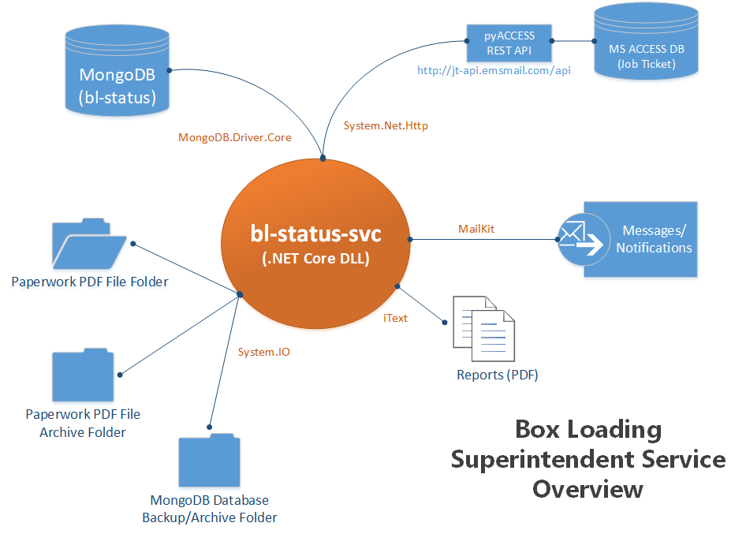

# bl-status-svc
## bl-status background superintendent service

The purpose of this Service/Daemon is to perform various Box Loading Status system maintenance tasks.  Microsoft's .NET Core Framework for Linux (2.x) is used to compile and deploy C#/.NET code for execution on the Ubuntu Linux server (SystemD) that is currently hosting the application.

The Service utilizes several Open-Source .NET libraries to define and schedule Jobs:

* **FluentScheduler** Job/Task Scheduler (https://github.com/fluentscheduler/FluentScheduler)
* **iText** PDF Library (https://itextpdf.com/)
* **MailKit** Email Library (http://www.mimekit.net/)
* **Mongo C#** .NET Database Driver (https://mongodb.github.io/mongo-csharp-driver/)
* **NLog** .NET Logging (http://nlog-project.org/)
